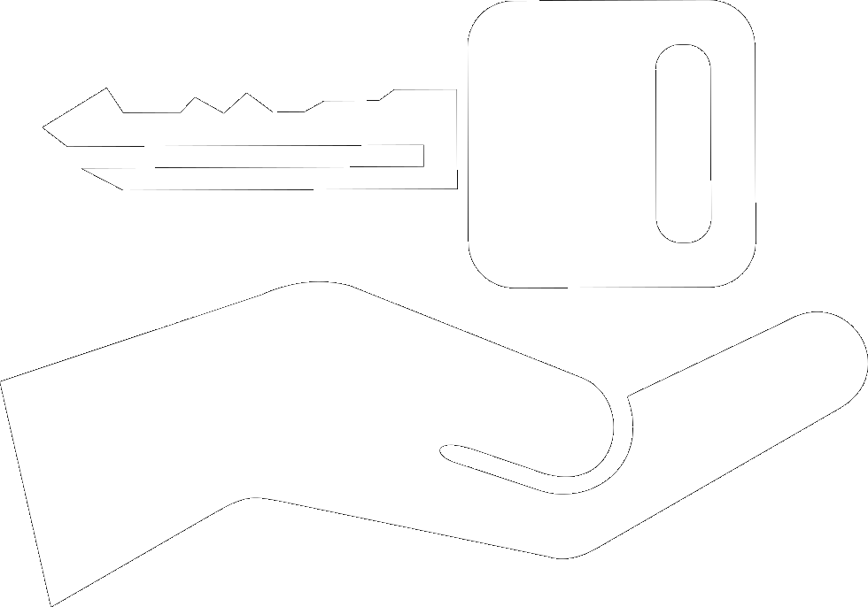

# GaadiGo [](https://app.netlify.com/sites/gaadigo/deploys)



GaadiGo is a mini project that demonstrates web design concepts through a car rent booking website.

## File Structure
```
netlify/functions - Serverless functions (just for razorpay capture lol)
public/assets     - Static Bootstrap Assets and Logos
public/components - Reusable HTML components
public/css        - CSS files
public/img        - Image files
public/js         - All JS files, custom ES6 modules and regular files
public/           - All html files
```

## Environment Vars
Set these vars in netlify, they are used in server-side functions

- RAZORPAY_KEY_ID
- RAZORPAY_KEY_SECRET

Also set RAZORPAY_KEY_ID in `public/js/checkout.js` manually.

## Stack
- Firestore - Database
- Firebase Storage - Image storage
- Netlify - Serverless Functions + Webhost
- Razorpay - Payments

## Languages
- HTML5
- Bootstrap CSS
- Vanilla JS

## Notes
- This site has been tested and performs best (and as intended) on Firefox.
- Some pages may only function as intended on second load due to the nature of caching; this is due to js loading issues that are left unresolved to avoid additional complexity.
- Images may not load and instead display an "Error retrieving image" error. This is likely caused due to the exhaustion of Firebase Storage's 1GB daily download limit. You may want to avoid loading `https://gaadigo.netlify.app/findcar.html` too many times to mitigate this.
- Payments status can be monitored on Razorpay dashboard in test mode.
- Refer this [resource](https://razorpay.com/docs/payments/payments/test-card-upi-details) for information on razorpay test payment methods.